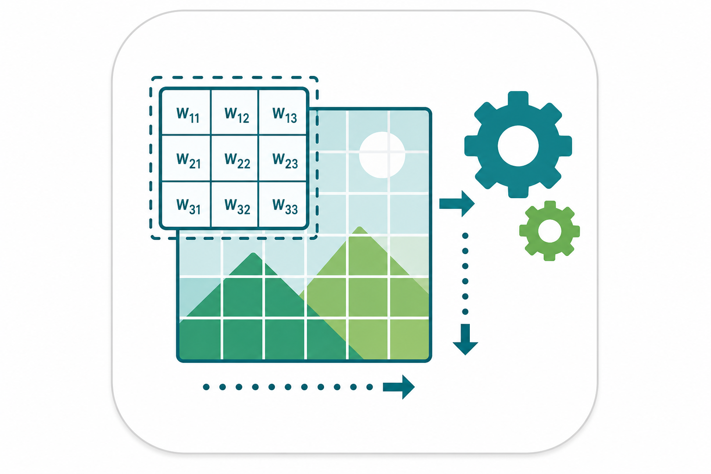

# Datasets for Module 02: Image Processing Basics

## No Upload Required! All datasets auto-download.

### Datasets Used:

| Dataset | Source | Size | Auto-Download |
|---------|--------|------|---------------|
| scikit-image built-ins | `skimage.data` | ~50 images | `from skimage import data` |
| CIFAR-10 (subset) | torchvision | 60K images (32×32) | `torchvision.datasets.CIFAR10(download=True)` |
| Synthetic noise/shapes | Generated in code | Variable | Created with numpy |

### Quick Usage:

```python
# CIFAR-10 (auto-downloads ~170MB on first use)
import torchvision
cifar10 = torchvision.datasets.CIFAR10(root='./data', train=True, download=True)
# Use only first 100 images for fast experiments:
small_subset = [cifar10[i][0] for i in range(100)]

# scikit-image (built-in, no download)
from skimage import data
img = data.camera()  # Classic image for edge detection
img = data.coins()   # Good for morphological operations

# Synthetic noisy images (generated on-the-fly)
import numpy as np
clean = data.camera().astype(np.float64)
noisy = clean + np.random.normal(0, 25, clean.shape)  # Gaussian noise σ=25

# Synthetic binary shapes (for morphology)
binary = np.zeros((128, 128), dtype=np.uint8)
binary[30:100, 30:100] = 255  # Rectangle
```

### Why These Datasets?

- **CIFAR-10 subset**: Real photographs, diverse content, tiny size (32×32) for fast convolution demos
- **scikit-image**: Standard test images used in research papers
- **Synthetic**: Controlled noise levels for quantitative denoising evaluation
