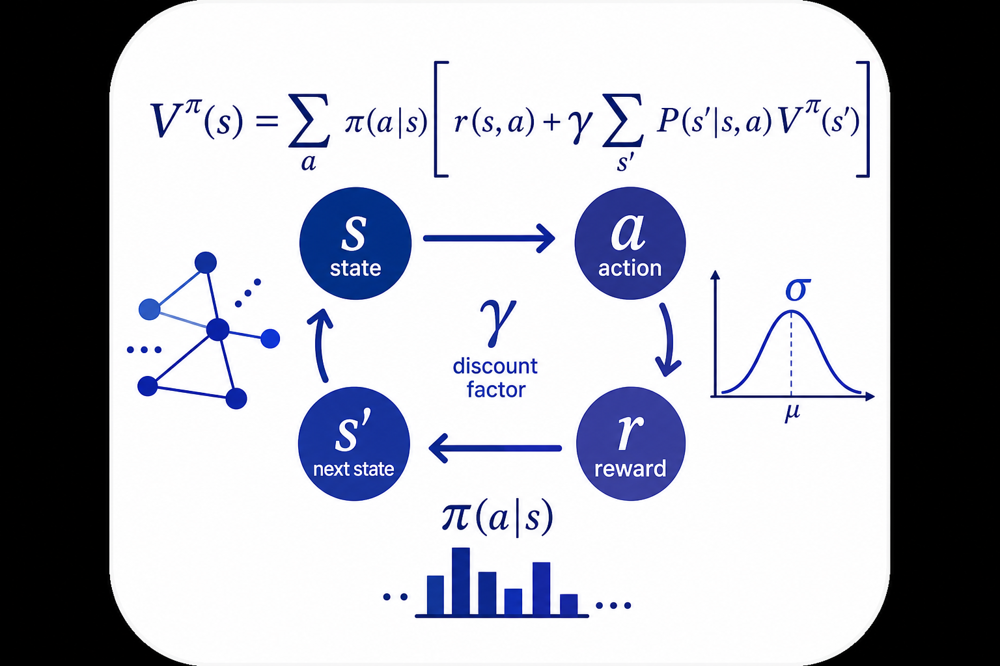

# Bellman Equations

## Overview

The Bellman equations are the central recursive equations of dynamic programming and reinforcement learning, expressing the value of a state as the immediate reward plus the discounted value of successor states. This document derives the Bellman expectation equation from first principles, develops the Bellman optimality equation, proves the Banach contraction mapping theorem, and analyzes the convergence rate of value iteration.

## Prerequisites

- Probability theory (conditional expectation, Module 03.1)
- MDP framework (Module 03.2)
- Real analysis (metric spaces, completeness)

---

## 1. Mathematical Foundations

### 1.1 Core Definition — The Bellman Expectation Equation

For a policy $\pi$, the state-value function $V^\pi$ satisfies:

$$V^\pi(s) = \sum_{a} \pi(a \mid s) \left[R(s, a) + \gamma \sum_{s'} T(s' \mid s, a) V^\pi(s')\right]$$

### 1.2 Full Derivation from First Principles

**Step 1:** Start from the definition of the value function:

$$V^\pi(s) = \mathbb{E}_\pi\left[\sum_{t=0}^{\infty} \gamma^t r_t \;\middle|\; s_0 = s\right]$$

**Step 2:** Separate the first reward from the rest:

$$= \mathbb{E}_\pi\left[r_0 + \sum_{t=1}^{\infty} \gamma^t r_t \;\middle|\; s_0 = s\right]$$

$$= \mathbb{E}_\pi[r_0 \mid s_0 = s] + \gamma \, \mathbb{E}_\pi\left[\sum_{t=1}^{\infty} \gamma^{t-1} r_t \;\middle|\; s_0 = s\right]$$

**Step 3:** Apply the tower property (law of iterated expectations), conditioning on $a_0$ and $s_1$:

$$= \mathbb{E}_\pi[r_0 \mid s_0 = s] + \gamma \, \mathbb{E}_\pi\left[\mathbb{E}_\pi\left[\sum_{t=1}^{\infty} \gamma^{t-1} r_t \;\middle|\; s_1\right] \;\middle|\; s_0 = s\right]$$

**Step 4:** By the Markov property, the inner expectation depends only on $s_1$:

$$\mathbb{E}_\pi\left[\sum_{t=1}^{\infty} \gamma^{t-1} r_t \;\middle|\; s_1 = s'\right] = V^\pi(s')$$

**Step 5:** Expand the expectations over the policy and transitions:

$$V^\pi(s) = \sum_a \pi(a \mid s) R(s, a) + \gamma \sum_a \pi(a \mid s) \sum_{s'} T(s' \mid s, a) V^\pi(s')$$

**Step 6:** Factor:

$$V^\pi(s) = \sum_a \pi(a \mid s) \left[R(s, a) + \gamma \sum_{s'} T(s' \mid s, a) V^\pi(s')\right]$$

**Result (Bellman Expectation Equation for $V^\pi$):**

$$\boxed{V^\pi(s) = \sum_a \pi(a \mid s)\left[R(s,a) + \gamma \sum_{s'} T(s' \mid s, a) V^\pi(s')\right]}$$
$\blacksquare$

**For $Q^\pi$:** Similarly:

$$Q^\pi(s, a) = R(s, a) + \gamma \sum_{s'} T(s' \mid s, a) \sum_{a'} \pi(a' \mid s') Q^\pi(s', a')$$

### 1.3 Bellman Optimality Equation

**Derivation:**

**Step 1:** The optimal value function is $V^*(s) = \max_\pi V^\pi(s)$.

**Step 2:** The optimal policy is greedy w.r.t. $V^*$: $\pi^*(s) = \arg\max_a Q^*(s, a)$.

**Step 3:** Substituting the deterministic optimal policy into the Bellman expectation equation:

$$V^*(s) = \max_a \left[R(s, a) + \gamma \sum_{s'} T(s' \mid s, a) V^*(s')\right]$$

**Step 4:** For $Q^*$:

$$Q^*(s, a) = R(s, a) + \gamma \sum_{s'} T(s' \mid s, a) \max_{a'} Q^*(s', a')$$

**Result (Bellman Optimality Equations):**

$$\boxed{V^*(s) = \max_a\left[R(s,a) + \gamma\sum_{s'}T(s'\mid s,a)V^*(s')\right]}$$

$$\boxed{Q^*(s,a) = R(s,a) + \gamma\sum_{s'}T(s'\mid s,a)\max_{a'}Q^*(s',a')}$$

### 1.4 Proof of the Banach Contraction Mapping Theorem

**Theorem (Banach Fixed-Point Theorem):** Let $(X, d)$ be a complete metric space and $\mathcal{T}: X \to X$ a contraction mapping with constant $\gamma \in [0, 1)$:

$$d(\mathcal{T}x, \mathcal{T}y) \leq \gamma \, d(x, y) \quad \forall x, y \in X$$

Then $\mathcal{T}$ has a unique fixed point $x^*$, and for any $x_0 \in X$, the sequence $x_{n+1} = \mathcal{T}(x_n)$ converges to $x^*$.

**Proof:**

**Step 1 — Existence.** Start with any $x_0$. Define $x_n = \mathcal{T}^n(x_0)$. We show $\{x_n\}$ is Cauchy.

For $n > m$:

$$d(x_m, x_n) \leq d(x_m, x_{m+1}) + d(x_{m+1}, x_{m+2}) + \cdots + d(x_{n-1}, x_n)$$

**Step 2:** By the contraction property: $d(x_k, x_{k+1}) = d(\mathcal{T}x_{k-1}, \mathcal{T}x_k) \leq \gamma \, d(x_{k-1}, x_k)$. By induction:

$$d(x_k, x_{k+1}) \leq \gamma^k d(x_0, x_1)$$

**Step 3:** Sum the geometric series:

$$d(x_m, x_n) \leq \sum_{k=m}^{n-1} \gamma^k d(x_0, x_1) \leq \frac{\gamma^m}{1 - \gamma} d(x_0, x_1)$$

**Step 4:** Since $\gamma < 1$, $\gamma^m \to 0$ as $m \to \infty$, so $\{x_n\}$ is Cauchy. By completeness of $(X, d)$, $x_n \to x^*$ for some $x^* \in X$.

**Step 5 — Fixed point.** By continuity of $\mathcal{T}$ (contractions are Lipschitz-continuous):

$$x^* = \lim_{n \to \infty} x_{n+1} = \lim_{n \to \infty} \mathcal{T}(x_n) = \mathcal{T}\!\left(\lim_{n \to \infty} x_n\right) = \mathcal{T}(x^*)$$

**Step 6 — Uniqueness.** Suppose $x^*$ and $y^*$ are both fixed points:

$$d(x^*, y^*) = d(\mathcal{T}x^*, \mathcal{T}y^*) \leq \gamma \, d(x^*, y^*)$$

Since $\gamma < 1$, this implies $d(x^*, y^*) = 0$, so $x^* = y^*$.

**Result:**

$$\boxed{x^* = \lim_{n\to\infty}\mathcal{T}^n(x_0), \quad d(x_n, x^*) \leq \frac{\gamma^n}{1-\gamma}d(x_0, x_1)}$$
$\blacksquare$

### 1.5 Convergence Rate of Value Iteration

**Value iteration:** $V_{k+1} = \mathcal{T}V_k$ where $\mathcal{T}$ is the Bellman optimality operator.

**Convergence rate:** From the contraction bound:

$$\|V_k - V^*\|_\infty \leq \frac{\gamma^k}{1 - \gamma}\|V_1 - V_0\|_\infty$$

To achieve $\|V_k - V^*\|_\infty \leq \varepsilon$, we need:

$$k \geq \frac{\log(\|V_1 - V_0\|_\infty / (\varepsilon(1-\gamma)))}{\log(1/\gamma)}$$

For $\gamma = 0.99$, $\varepsilon = 0.01$: $k \approx 100 \ln(100 \|V_1 - V_0\|_\infty) \approx 1000$ iterations.

**Intuition:** The convergence is geometric (linear in the log-error). Higher $\gamma$ means slower convergence because the agent must "look further ahead" and information propagates more slowly through the state space.

---

## 2. Algorithm / Method

### 2.1 Pseudocode: Value Iteration

```
Algorithm: Value_Iteration
Input: MDP (S, A, T, R, γ), tolerance ε
Output: Optimal value V*, optimal policy π*

1. INITIALIZE: V(s) = 0 for all s
2. REPEAT:
     δ = 0
     For each s ∈ S:
       v = V(s)
       V(s) = max_a [R(s,a) + γ Σ_{s'} T(s'|s,a) V(s')]
       δ = max(δ, |v - V(s)|)
     UNTIL δ < ε
3. EXTRACT POLICY:
     π*(s) = argmax_a [R(s,a) + γ Σ_{s'} T(s'|s,a) V(s')]
4. Return V, π*
```

### 2.2 Complexity Analysis

- **Per iteration:** $O(|\mathcal{S}|^2 |\mathcal{A}|)$
- **Number of iterations:** $O\!\left(\frac{1}{1-\gamma}\log\frac{1}{\varepsilon(1-\gamma)}\right)$
- **Total:** $O\!\left(\frac{|\mathcal{S}|^2|\mathcal{A}|}{1-\gamma}\log\frac{1}{\varepsilon(1-\gamma)}\right)$

---

## 3. Connection to Reinforcement Learning

### 3.1 MDP Formulation

- **State:** $s_t$ — environment configuration
- **Action:** $a_t$ — agent's decision
- **Reward:** $r_t = R(s_t, a_t)$ — immediate feedback
- **Transition:** $s_{t+1} \sim T(\cdot \mid s_t, a_t)$ — environment dynamics

### 3.2 Why RL?

The Bellman equations are the backbone of RL. Model-based methods (value/policy iteration) solve them directly when $T$ and $R$ are known. Model-free methods (TD learning, Q-learning) solve them via sampling when the model is unknown. Understanding the contraction property explains why these algorithms converge.

---

## 4. Dataset

- **Name:** Synthetic MDPs and GridWorld environments
- **Size:** Configurable state/action spaces
- **Auto-download:**

```python
import numpy as np
n_states, n_actions = 25, 4
T = np.random.dirichlet(np.ones(n_states), (n_states, n_actions))
R = np.random.randn(n_states, n_actions)
gamma = 0.99
```

---

## 5. Key Equations Summary

| Equation | Meaning |
|----------|---------|
| $V^\pi(s) = \sum_a \pi(a\mid s)[R + \gamma\sum_{s'}TV^\pi(s')]$ | Bellman expectation equation |
| $V^*(s) = \max_a[R + \gamma\sum_{s'}TV^*(s')]$ | Bellman optimality equation |
| $\|\mathcal{T}V_1 - \mathcal{T}V_2\| \leq \gamma\|V_1 - V_2\|$ | Contraction mapping |
| $\|V_k - V^*\| \leq \gamma^k/(1-\gamma)\cdot\|V_1-V_0\|$ | Convergence rate bound |
| $Q^*(s,a) = R + \gamma\sum_{s'}\max_{a'}Q^*(s',a')$ | Bellman optimality for Q |

---

## 6. References

- Bellman, R. *Dynamic Programming*, Princeton University Press, 1957.
- Bertsekas, D. P. & Tsitsiklis, J. N. *Neuro-Dynamic Programming*, Athena Scientific, 1996.
- Puterman, M. L. *Markov Decision Processes*, Wiley, 1994.
- Sutton, R. S. & Barto, A. G. *Reinforcement Learning: An Introduction*, 2nd ed., MIT Press, 2018, Ch. 3–4.
