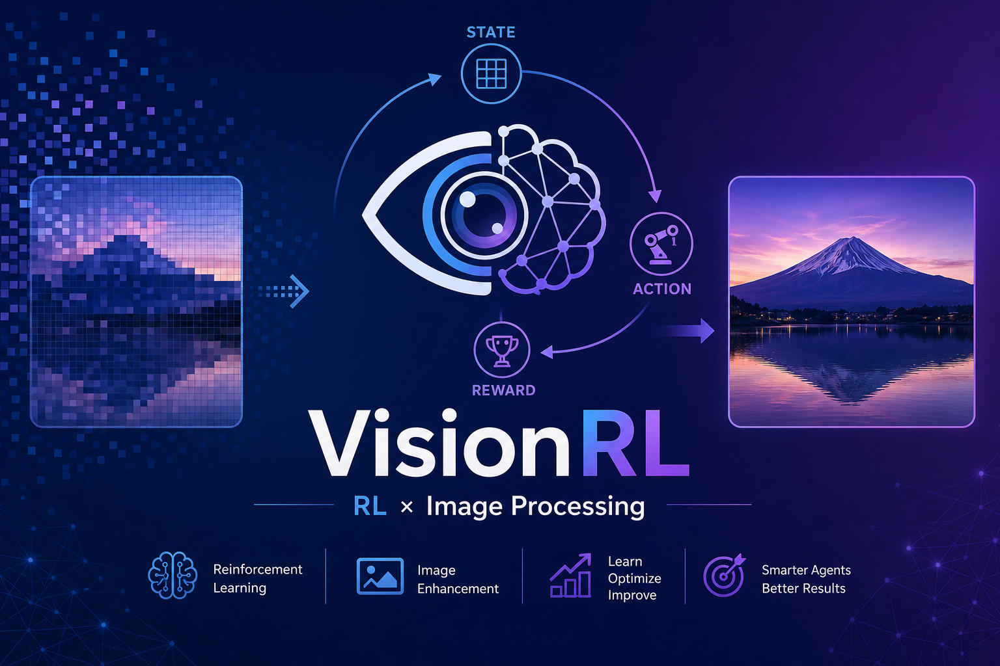
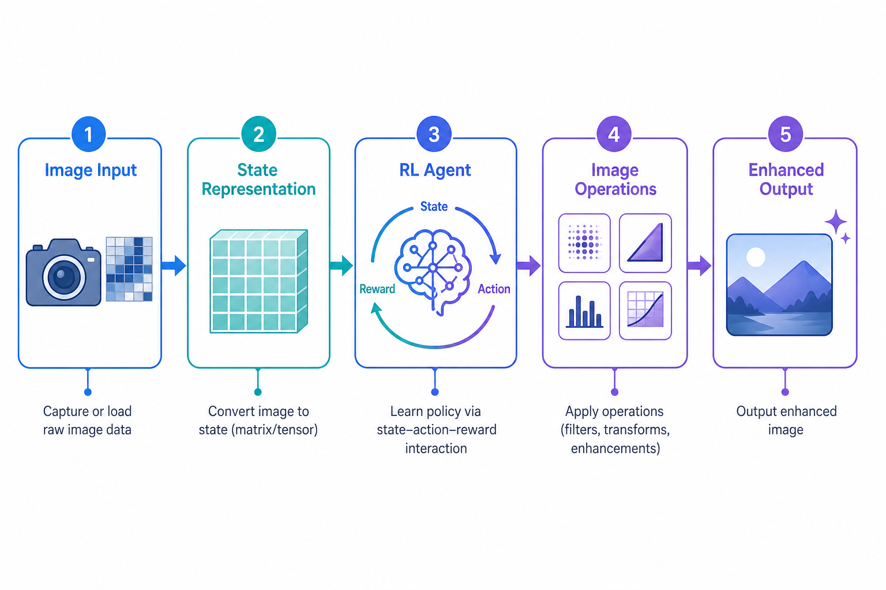
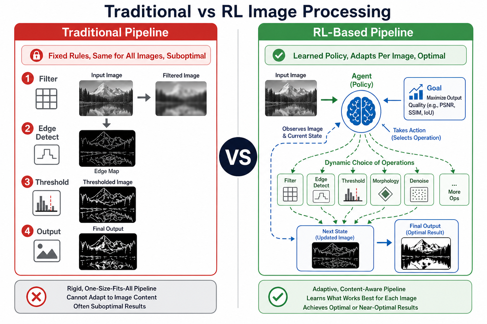
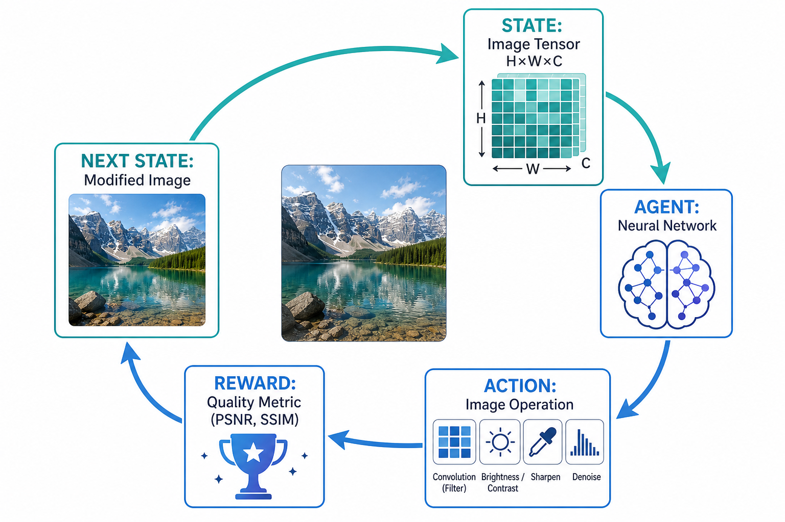
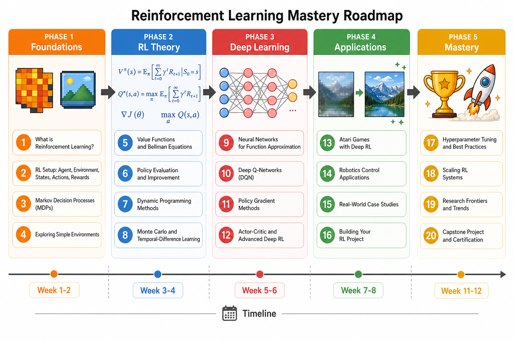
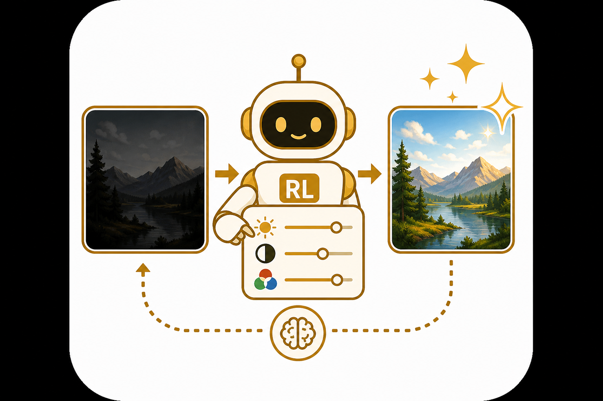
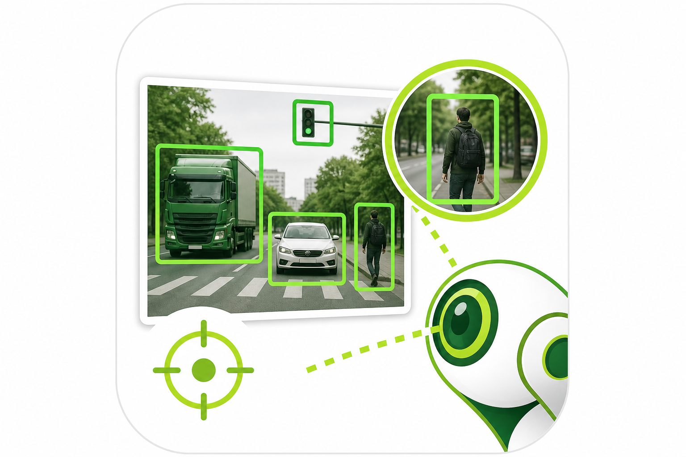
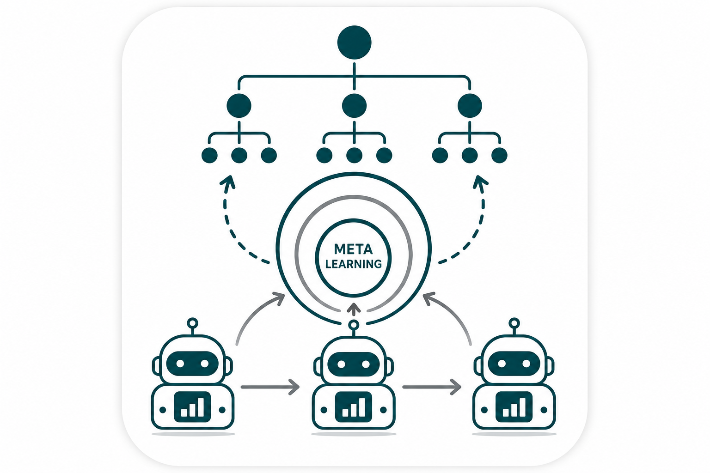
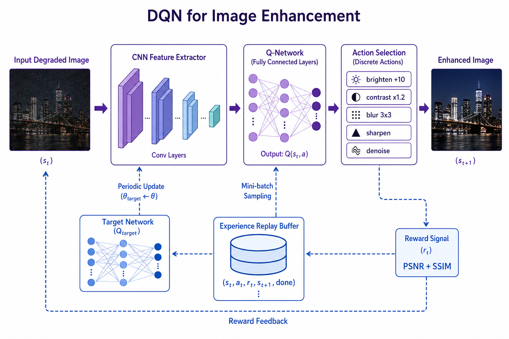

# VisionRL — Reinforcement Learning for Image Processing



## Complete Step-by-Step Course: From Pixels to Intelligent Vision Agents

> **Learn to solve EVERY image processing problem using Reinforcement Learning — from the very beginning, with deep math, real visuals, and hands-on code.**

---

## Pipeline Overview



---

## Course Philosophy

```
Image Processing = Sequential Decision Making
RL = Learning Optimal Sequences of Decisions
∴ RL + Images = Intelligent Vision Systems
```

Every image processing pipeline is a **sequence of decisions**: which filter to apply, how much to adjust contrast, where to crop. **RL learns this sequence optimally!**

### Traditional vs RL-Based Image Processing



### The RL-Image Environment



---

## Course Roadmap



## Detailed Module Breakdown

###  Module 01: Image Foundations
| # | Topic | Key Math | Notebook |
|---|-------|----------|----------|
| 1.1 | What Is An Image | $f(x,y) = i(x,y) \cdot r(x,y)$ | `01_What_Is_An_Image/` |
| 1.2 | Pixels and Channels | $\mathbf{p} = (r,g,b) \in [0,255]^3$ | `02_Pixels_And_Channels/` |
| 1.3 | Color Spaces | RGB→HSV→LAB conversions | `03_Color_Spaces/` |
| 1.4 | Image as Matrix | SVD: $\mathbf{I} = \mathbf{U}\Sigma\mathbf{V}^T$ | `04_Image_As_Matrix/` |
| 1.5 | Image Histograms | $p(k) = h(k)/(M \times N)$ | `05_Image_Histograms/` |

###  Module 02: Image Processing Basics
| # | Topic | Key Math | Notebook |
|---|-------|----------|----------|
| 2.1 | Filters & Convolutions | $(I*K)[m,n] = \sum\sum I[m-i,n-j] \cdot K[i,j]$ | `01_Filters_And_Convolutions/` |
| 2.2 | Edge Detection | $\|\nabla I\| = \sqrt{G_x^2 + G_y^2}$ | `02_Edge_Detection/` |
| 2.3 | Morphological Operations | $A \ominus B$, $A \oplus B$, Opening, Closing | `03_Morphological_Operations/` |
| 2.4 | Image Transformations | Affine: $\mathbf{x}' = \mathbf{A}\mathbf{x} + \mathbf{t}$ | `04_Image_Transformations/` |
| 2.5 | Noise and Denoising | $I_{noisy} = I_{clean} + \mathcal{N}(0, \sigma^2)$ | `05_Noise_And_Denoising/` |

###  Module 03: RL Mathematical Foundations
| # | Topic | Key Math | Notebook |
|---|-------|----------|----------|
| 3.1 | Probability for RL | $P(A|B) = P(B|A)P(A)/P(B)$ | `01_Probability_For_RL/` |
| 3.2 | Markov Decision Process | MDP = $(S, A, P, R, \gamma)$ | `02_Markov_Decision_Process/` |
| 3.3 | Bellman Equations | $V^*(s) = \max_a [R + \gamma \sum P V^*]$ | `03_Bellman_Equations/` |
| 3.4 | Value Functions | $Q^\pi(s,a) = \mathbb{E}[\sum \gamma^t r_t]$ | `04_Value_Functions/` |
| 3.5 | Policy & Optimality | $\pi^* = \arg\max_\pi V^\pi(s)$ | `05_Policy_And_Optimality/` |

###  Module 04: Basic RL Algorithms
| # | Topic | Key Math | Notebook |
|---|-------|----------|----------|
| 4.1 | Multi-Armed Bandits | $\epsilon$-greedy, UCB, Thompson Sampling | `01_Multi_Armed_Bandits/` |
| 4.2 | Dynamic Programming | Policy Iteration, Value Iteration | `02_Dynamic_Programming/` |
| 4.3 | Monte Carlo Methods | $V(s) \leftarrow \text{average}(G_t)$ | `03_Monte_Carlo_Methods/` |
| 4.4 | TD Learning & SARSA | $V(s) \leftarrow V(s) + \alpha[r + \gamma V(s') - V(s)]$ | `04_TD_Learning_SARSA/` |
| 4.5 | Q-Learning | $Q(s,a) \leftarrow Q + \alpha[r + \gamma \max_{a'} Q(s',a') - Q]$ | `05_Q_Learning/` |

###  Module 05: Deep Learning for Images
| # | Topic | Key Math | Notebook |
|---|-------|----------|----------|
| 5.1 | Neural Network Basics | Backprop: $\frac{\partial L}{\partial w} = \frac{\partial L}{\partial z} \cdot \frac{\partial z}{\partial w}$ | `01_Neural_Network_Basics/` |
| 5.2 | CNN from Scratch | Conv layers, pooling, stride | `02_CNN_From_Scratch/` |
| 5.3 | Feature Extraction | CNN intermediate representations | `03_Feature_Extraction/` |
| 5.4 | Transfer Learning | Pre-trained models as RL state encoders | `04_Transfer_Learning/` |
| 5.5 | Image Classification | End-to-end CNN training | `05_Image_Classification/` |

###  Module 06: Deep Reinforcement Learning
| # | Topic | Key Math | Notebook |
|---|-------|----------|----------|
| 6.1 | DQN | $L = \mathbb{E}[(r + \gamma \max Q' - Q)^2]$ | `01_DQN_Deep_Q_Network/` |
| 6.2 | Policy Gradient | $\nabla J = \mathbb{E}[\nabla\log\pi \cdot G_t]$ | `02_Policy_Gradient_REINFORCE/` |
| 6.3 | Actor-Critic (A2C) | Actor $\pi_\theta$ + Critic $V_\phi$ | `03_Actor_Critic_A2C/` |
| 6.4 | PPO | $L^{CLIP} = \min(r_t A_t, \text{clip}(r_t) A_t)$ | `04_PPO_Algorithm/` |
| 6.5 | Advanced Tricks | PER, Double DQN, Dueling, Noisy Nets | `05_Experience_Replay_And_Tricks/` |

###  Module 07: RL for Image Enhancement
| # | Topic | Application | Notebook |
|---|-------|-------------|----------|
| 7.1 | Brightness/Contrast Agent | Auto-exposure correction | `01_Brightness_Contrast_Agent/` |
| 7.2 | Color Correction Agent | White balance, color grading | `02_Color_Correction_Agent/` |
| 7.3 | Denoising Agent | Adaptive noise removal | `03_Denoising_Agent/` |
| 7.4 | Super Resolution Agent | Intelligent upscaling | `04_Super_Resolution_Agent/` |
| 7.5 | HDR Tone Mapping Agent | Dynamic range compression | `05_HDR_Tone_Mapping_Agent/` |

###  Module 08: RL for Image Segmentation
| # | Topic | Application | Notebook |
|---|-------|-------------|----------|
| 8.1 | Pixel Classification Agent | Assign pixels to classes | `01_Pixel_Classification_Agent/` |
| 8.2 | Region Growing Agent | Grow regions from seeds | `02_Region_Growing_Agent/` |
| 8.3 | Boundary Detection Agent | Trace object boundaries | `03_Boundary_Detection_Agent/` |
| 8.4 | Semantic Segmentation RL | Deep RL segmentation | `04_Semantic_Segmentation_RL/` |
| 8.5 | Interactive Segmentation | Agent learns where to click | `05_Interactive_Segmentation/` |

###  Module 09: RL for Object Detection
| # | Topic | Application | Notebook |
|---|-------|-------------|----------|
| 9.1 | Attention-Based Search | Learn where to look | `01_Attention_Based_Search/` |
| 9.2 | Bounding Box Refinement | Iterative box adjustment | `02_Bounding_Box_Refinement/` |
| 9.3 | Active Object Localization | Tree-structured search | `03_Active_Object_Localization/` |
| 9.4 | Multi-Object Detection | Sequential object finding | `04_Multi_Object_Detection/` |
| 9.5 | Visual Question Answering | Attend regions for QA | `05_Visual_Question_Answering/` |

###  Module 10: RL for Image Generation
| # | Topic | Application | Notebook |
|---|-------|-------------|----------|
| 10.1 | RL with GANs | Guide GAN training | `01_RL_With_GANs/` |
| 10.2 | Neural Style Transfer RL | Control style parameters | `02_Neural_Style_Transfer_RL/` |
| 10.3 | Image Inpainting Agent | Fill missing regions | `03_Image_Inpainting_Agent/` |
| 10.4 | Text-to-Image RL (RLHF) | Align generation with preference | `04_Text_To_Image_RL/` |
| 10.5 | Creative Image Agent | Agent learns to paint! | `05_Creative_Image_Agent/` |

###  Module 11: Advanced Topics
| # | Topic | Key Concept | Notebook |
|---|-------|-------------|----------|
| 11.1 | Multi-Agent Vision | Collaborative image processing | `01_Multi_Agent_Vision/` |
| 11.2 | Hierarchical RL Vision | High-level + low-level agents | `02_Hierarchical_RL_Vision/` |
| 11.3 | Meta-Learning for Vision | Learning to learn new tasks | `03_Meta_Learning_For_Vision/` |
| 11.4 | Curriculum Learning | Progressive difficulty training | `04_Curriculum_Learning/` |
| 11.5 | Sim-to-Real Transfer | Synthetic → real image transfer | `05_Sim_To_Real_Transfer/` |

###  Module 12: Real-World Projects
| # | Project | Description | Notebook |
|---|---------|-------------|----------|
| 12.1 | Medical Image Enhancement | RL for X-ray/CT enhancement | `01_Medical_Image_Enhancement/` |
| 12.2 | Autonomous Image Editor | Auto photo editing pipeline | `02_Autonomous_Image_Editor/` |
| 12.3 | Satellite Image Analysis | RL for remote sensing | `03_Satellite_Image_Analysis/` |
| 12.4 | Video Frame Enhancement | Temporal consistency in video | `04_Video_Frame_Enhancement/` |
| 12.5 | Complete Vision Pipeline | **CAPSTONE**: Full RL vision system | `05_Complete_Vision_Pipeline/` |

---

## How to Use This Course

### On Google Colab (Recommended):
1. Navigate to any notebook in this repo
2. Click the "Open in Colab" badge at the top
3. Run cells sequentially (Shift+Enter)
4. All dependencies install automatically

### Locally:
```bash
pip install numpy matplotlib opencv-python-headless scikit-image torch torchvision
jupyter notebook
```

### Study Path:
```
Week 1-2:  Module 01 + 02 (Image foundations)
Week 3-4:  Module 03 + 04 (RL theory)
Week 5-6:  Module 05 + 06 (Deep Learning + Deep RL)
Week 7-8:  Module 07 + 08 (Enhancement + Segmentation)
Week 9-10: Module 09 + 10 (Detection + Generation)
Week 11-12: Module 11 + 12 (Advanced + Projects)
```

---

## DQN Architecture for Image Enhancement



## The Big Picture: Why RL for Images?

```
Traditional Image Processing:
  Human designs fixed pipeline → Apply to all images → Suboptimal for many cases

RL-based Image Processing:
  Agent LEARNS optimal pipeline → Adapts per image → Optimal for each case
```

### The RL-Image MDP:

```
State s_t:     Current image (pixel tensor)
Action a_t:    Image operation (filter, transform, adjustment)
Reward r_t:    Quality metric (PSNR, SSIM, IoU, aesthetic score)
Transition:    s_{t+1} = apply(a_t, s_t)
Goal:          π* = argmax Σ γ^t · r_t
```

---

## Requirements

- Python 3.8+
- NumPy, Matplotlib, OpenCV, scikit-image
- PyTorch (for Modules 5+)
- Google Colab account (free, with GPU)

---

## License

Educational use. Created for the FlashVision project.
